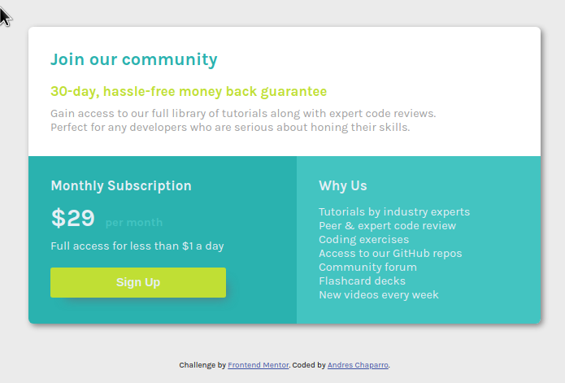

# Frontend Mentor - Single price grid component solution

This is a solution to the [Single price grid component challenge on Frontend Mentor](https://www.frontendmentor.io/challenges/single-price-grid-component-5ce41129d0ff452fec5abbbc). Frontend Mentor challenges help you improve your coding skills by building realistic projects. 

## Table of contents

- [Overview](#overview)
  - [The challenge](#the-challenge)
  - [Screenshot](#screenshot)
  - [Links](#links)
- [My process](#my-process)
  - [Built with](#built-with)
  - [What I learned](#what-i-learned)
  - [Continued development](#continued-development)
  - [Useful resources](#useful-resources)
- [Author](#author)
- [Acknowledgments](#acknowledgments)

**Note: Delete this note and update the table of contents based on what sections you keep.**

## Overview

### The challenge

Users should be able to: 

- View the optimal layout for the component depending on their device's screen size
- See a hover state on desktop for the Sign Up call-to-action

### Screenshot




### Links

- Solution URL: [Add solution URL here](https://t0ntin.github.io/single-price-grid-component-master2/)

## My process

### Built with

- Semantic HTML5 markup
- CSS custom properties
- Flexbox

### What I learned

I practiced using flexbox. I was hoping to make it responsive without using media queries. The bottom right container wasn't wrapping at first. It was because I needed to use max-width instead of width for the main container.
I also learned that if  border-radius is not working, I can use overflow:hidden; to fix it.


```css
  border-radius: 7px;
  overflow: hidden;
```
```js
const proudOfThisFunc = () => {
  console.log('🎉')
}
```

### Continued development


### Useful resources

- [Example resource 1](https://www.stackoverflow.com) - This helped me when my flex items were not wrapping and when the borde radius wasn't working.

## Author

- Website - [Add your name here](https://www.your-site.com)
- Frontend Mentor - [@yourusername](https://www.frontendmentor.io/profile/t0ntin)
- Twitter - [@yourusername](https://www.twitter.com/t0ntinx)


## Acknowledgments
  N/A
